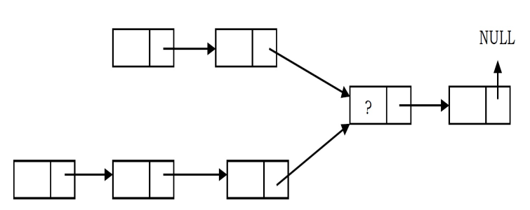

# Linked list Problems

```
01. Suppose there are two singly linked lists both of which intersect at some point and become a single linked list. The head or start pointers of both the lists are known, but the intersecting node is not known. Also, the number of nodes in each of the lists before they intersect is unknown and may be different in each list. List1 may have n nodes before it reaches the intersection point, and List2 might have m nodes before it reaches the intersection point where m and n may be m = n,m < n or m > n. Give an algorithm for finding the merging point.
```


```
Solution 1: Nested loop

1. pick 1 element in head1 as reference and traverse all the element in head2 and check both are same
2. If any element in head2 is not matching then pick another element from head1
3. repeat 1 and 2

Time Complexity: O(mn). Space Complexity: O(1).
```

```
Solution 2: Using stack

• Create two stacks: one for the first list and one for the second list.
• Traverse the first list and push all the node addresses onto the first stack.
• Traverse the second list and push all the node addresses onto the secondstack.
• Now both stacks contain the node address of the corresponding lists.
• Now compare the top node address of both stacks.
• If they are the same, take the top elements from both the stacks and keep them in some temporary variable (since both node addresses are node, it is enough if we use one temporary variable).
• Continue this process until the top node addresses of the stacks are not the same.
• This point is the one where the lists merge into a single list.
• Return the value of the temporary variable
```

```
Solution 3: Efficient method

• Find lengths (L1 and L2) of both lists.
• Take the difference d of the lengths.
• Make d steps in longer list.
• Step in both lists in parallel until links to next node match.

Total time complexity = O(max(m, n)) Space Complexity = O(1).
```
